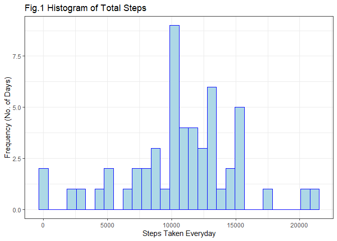
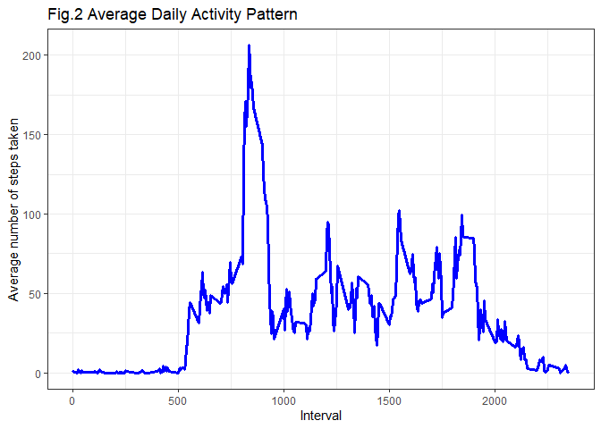
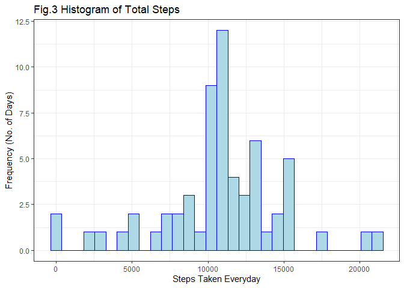
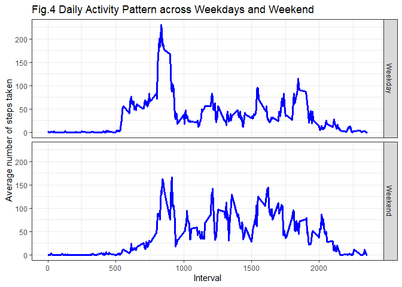

## Introduction

A lot of activity monitoring devices are now widely in use by various fitness enthusiasts who would like to see the quantification of their health and physical activity. They aim to see aspects of their health in measurable terms in order to gain more knowledge and control over their health. Such monitoring devices have made it relatively easy to collect data regarding physical movements of an individual and as a result huge amount of data is generated. Current assignment attempts to take a look at one such dataset and explore ways to analyse it. This data was collected from an individual over a period of two months. The dataset has been downloaded from the course website for the purpose of this assignment.


## Loading and preprocessing the data

The given dataset is in zip format. In order to read the file let's first unzip and then read it.


```r
activity_data <- read.csv(unz("activity.zip", "activity.csv"))
```

Let's take a look at the data to understand what we have.


```r
head(activity_data)
```

```
##   steps       date interval
## 1    NA 2012-10-01        0
## 2    NA 2012-10-01        5
## 3    NA 2012-10-01       10
## 4    NA 2012-10-01       15
## 5    NA 2012-10-01       20
## 6    NA 2012-10-01       25
```

```r
summary(activity_data)
```

```
##      steps            date              interval     
##  Min.   :  0.00   Length:17568       Min.   :   0.0  
##  1st Qu.:  0.00   Class :character   1st Qu.: 588.8  
##  Median :  0.00   Mode  :character   Median :1177.5  
##  Mean   : 37.38                      Mean   :1177.5  
##  3rd Qu.: 12.00                      3rd Qu.:1766.2  
##  Max.   :806.00                      Max.   :2355.0  
##  NA's   :2304
```

```r
str(activity_data)
```

```
## 'data.frame':	17568 obs. of  3 variables:
##  $ steps   : int  NA NA NA NA NA NA NA NA NA NA ...
##  $ date    : chr  "2012-10-01" "2012-10-01" "2012-10-01" "2012-10-01" ...
##  $ interval: int  0 5 10 15 20 25 30 35 40 45 ...
```

Since the everyday data is identifiable by dates, we may want to look at trends across weekdays and weekend. Thus, having an additional column specifying weekday and weekend might be helpful.


```r
activity_data <- transform(activity_data, date = as.Date(activity_data$date))
activity_data$day <- weekdays(activity_data$date)
```


## What is mean total number of steps taken per day?
In order to calculate the mean total number of steps, we create a dataframe with a variable to see the total steps taken everyday.


```r
totalSteps <- aggregate(activity_data$steps, by=list(date = activity_data$date),
                        FUN = sum)
colnames(totalSteps) <- c("Date", "Steps")
head(totalSteps)
```

```
##         Date Steps
## 1 2012-10-01    NA
## 2 2012-10-02   126
## 3 2012-10-03 11352
## 4 2012-10-04 12116
## 5 2012-10-05 13294
## 6 2012-10-06 15420
```

We can take a look at this daily data in the form of a histogram.


```r
library(ggplot2)
g1 <- ggplot(totalSteps, aes(Steps))
g1 + geom_histogram(colour = "blue", fill = "light blue", bins = 30) + 
  labs(title = "Fig.1 Histogram of Total Steps") + 
  labs(x = "Steps Taken Everyday", y = "Frequency (No. of Days)")
```

<!-- -->

Calculating mean and median of the total steps taken per day:


```r
Mean <- mean(totalSteps$Steps, na.rm = TRUE)
Mean
```

```
## [1] 10766.19
```

```r
Median <- median(totalSteps$Steps, na.rm = TRUE)
Median
```

```
## [1] 10765
```


## What is the average daily activity pattern?

To study an average pattern emerging in the daily activity of the subject, we first calculate average number of steps averaged across all days and store these in a new dataframe.


```r
averagesteps <- aggregate(activity_data$steps, by = list(activity_data$interval),
                          FUN = mean, na.rm = TRUE)
colnames(averagesteps) <- c("Interval", "Average_Steps")
head(averagesteps)
```

```
##   Interval Average_Steps
## 1        0     1.7169811
## 2        5     0.3396226
## 3       10     0.1320755
## 4       15     0.1509434
## 5       20     0.0754717
## 6       25     2.0943396
```

Let's now take a look at how the average daily activity pattern appears. A time-series plot may serve as the best option to study such patterns.


```r
g2 <- ggplot(averagesteps, aes(x = Interval, y = Average_Steps))
g2 + geom_line(color = "blue", size = 1.2) + 
  labs(title = "Fig.2 Average Daily Activity Pattern", x = "Interval", 
       y = "Average number of steps taken")
```

<!-- -->

First look at the plot clearly shows that there have been no activity during the interval range between 0 to about 500. This can be attributed to the missing values in the initial few rows. The second clear observation is the spike in the number of steps taken somewhere in the interval range from 750 to 900. Nowhere else in the plot is such a spike seen. We can find the exact 5-minute interval during which the maximum steps have been taken.


```r
maxInterval <- averagesteps[which.max(averagesteps$Average_Steps), ]$Interval
maxInterval
```

```
## [1] 835
```

The maximum number of steps were taken during the 5-minute interval at 835.


## Imputing missing values

There are a lot of missing values seen in the dataset. We can find the total number of these missing values and find if they amount to a significant missing data.


```r
totalNA <- sum(is.na(activity_data$steps))
totalNA
```

```
## [1] 2304
```


There are a total of 2304 missing values in the 'steps' variable of the dataset. To confirm if all the NAs are in 'steps' variable only, we see:


```r
totalNA == sum(is.na(activity_data))
```

```
## [1] TRUE
```

Thus, there are a total of 2304 missing values in the dataset. All the computations above were done by ignoring these values. However, if we impute these missing values we can find out the impact on estimates of the total daily number of steps.

As one of the possible options we can replace every missing value with some mean number from the dataset. To carry out this step we make a copy of the original dataset and fill in the NAs with the mean number of steps for that corresponding 5-minute interval. 


```r
copydataset <- activity_data

meansteps <- function(x){
  averagesteps[averagesteps$Interval == x, ]$Average_Steps
}

for(i in 1:nrow(copydataset)){
  if (is.na(copydataset[i, ]$steps)) {
    copydataset[i, ]$steps <- meansteps(copydataset[i, ]$interval)
  }
}
```

We can now repeat our calculations like previously done. From this new dataset with imputed missing values we calculate total number of steps per day.


```r
totalStepsNew <- aggregate(copydataset$steps, by=list(date = copydataset$date),
                           FUN = sum)
colnames(totalStepsNew) <- c("Date", "Steps")
```

Let's create a histogram of the total number of steps taken per day.


```r
g3 <- ggplot(totalStepsNew, aes(Steps))
g3 + geom_histogram(colour = "blue", fill = "light blue", bins = 30) + 
  labs(title = "Fig.3 Histogram of Total Steps") + labs(x = "Steps Taken Everyday", 
                                                  y = "Frequency (No. of Days)")
```

<!-- -->

Calculating new mean and median and comparing them with previous calculations:


```r
NewMean <- mean(totalStepsNew$Steps)
NewMean
```

```
## [1] 10766.19
```

```r
NewMedian <- median(totalStepsNew$Steps)
NewMedian
```

```
## [1] 10766.19
```

```r
diffMean <- Mean - NewMean

diffMedian <- Median - NewMedian
```

Comparing these values with previously calculated mean and median we see that there is not much difference. The difference between the two means is 0, whereas the new median has only differed by -1.1886792. 


## Are there differences in activity patterns between weekdays and weekends?

Finally, as mentioned in the beginning, looking at daily data also calls for looking at trends according to the type of the day it is - Weekend or Weekday. This is so because our activities generally tend to differ according to different days of the week.

Thus, we create a factor variable with two levels - Weekend and Weekday.


```r
for (i in 1:nrow(copydataset)) {
  if (copydataset[i, ]$day %in% c("Saturday", "Sunday")) {
    copydataset[i, ]$day <- "Weekend"
  } else {
    copydataset[i, ]$day <- "Weekday"
  }
}
```

The average number of steps taken for every 5-minute intyerval and averaged across all days are now calculated and grouped according to the type of the day (Weekend or Weekday).


```r
avgSteps_copydataset <- aggregate(copydataset$steps, 
                                  by = list(copydataset$interval, copydataset$day),
                                  FUN=mean)
head(avgSteps_copydataset)
```

```
##   Group.1 Group.2          x
## 1       0 Weekday 2.25115304
## 2       5 Weekday 0.44528302
## 3      10 Weekday 0.17316562
## 4      15 Weekday 0.19790356
## 5      20 Weekday 0.09895178
## 6      25 Weekday 1.59035639
```

```r
colnames(avgSteps_copydataset) <- c("Interval", "Day_type", "Steps")
```

Lets now compare the results between weekdays and weekend through the following panel plot.


```r
g4 <- ggplot(avgSteps_copydataset, aes(x = Interval, y = Steps))
g4 + geom_line(color = "blue", size = 1.2) + facet_grid(Day_type~.) + 
  labs(title = "Fig.4 Daily Activity Pattern across Weekdays and Weekend", 
       x = "Interval", y = "Average number of steps taken")
```

<!-- -->

The first observed pattern that we saw in the previous such plot (Fig. 2) about the spike in the daily activity at the interval of 835 is seen here only in the Weekday panel plot and disappears in the Weekend panel plot. Secondly, we see some increase in the daily weekend activity across remaining 5-minute intervals as compared to daily weekday activity. 


## Conclusion

In this assignment we did some basic analytical computations. We analysed the data before and after imputing the missing values and studied its impact on the analysis. We also tried to study some patterns in the daily activity of the subject. By just looking at the data categorised according to weekend and weekday we could see a pattern of activity emerging that can easily lead to interpretations about one's weekly schedule of activities.

Through this assignment we are able to see how a seemingly simple dataset can be analysed in good detail by asking various questions. Further, we see how much efforts are needed in order to make our research as reproducible as possible. But, once its done, the whole efforts look worthy enough. Inculcating these practices of recording and documenting every little detail and making them our habits in report writing can go a long way.
